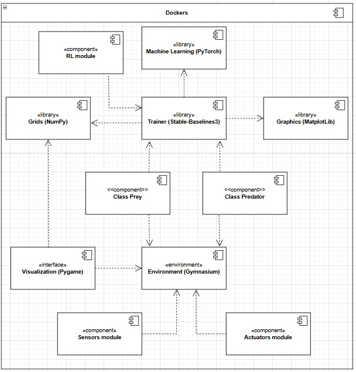
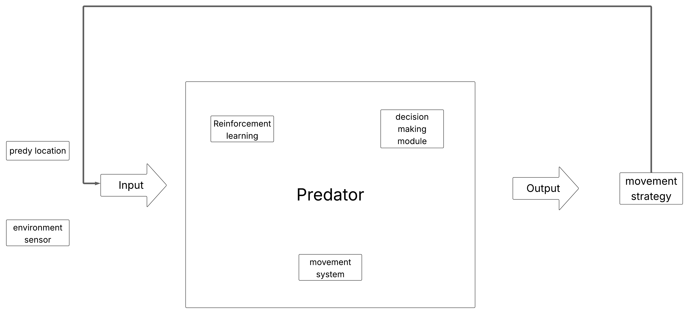
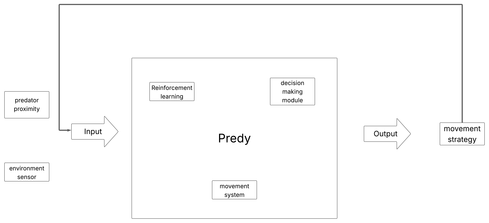

# Workshop 1: Predator-Prey Autonomous Adaptive Agent System Design

**Document versions:**
- [Download PDF version](docs/workshop1/Workshop_1.pdf)

**Authors:**  
Juan Diego Grajales Castillo - 20221020128  
Nicolas Castro Rivera - 20221020055  

**Course:** Systems Sciences, 2025-I  

## System Requirements Document

### Functional Specifications

#### Sensors

**Prey Sensors:**
- Proximity Sensor for detecting the Predator range is 5x5 grid. Hides the predator if it is back a wall.
- Position Sensor of walls and traps 7x7, he knows everything except the predator location.

**Predator Sensors:**
- Position Sensor for detecting the Prey in the map 10x10.
- Position Sensor for detecting the walls and traps, 6x6.

**Summary:**  
**Predator:** Position sensor for detecting prey, wall and trap detection sensor.  
**Prey:** Proximity sensor for detecting predators, wall and trap detection.

#### Actuators

**Predator:** motion control, environmental learning.  
**Prey:** movement control, trap identification, environmental learning.

### Reward Functions

**Predator:**
- Positive reward (+10) for capturing prey
- Positive reward (+0.05) for being within 2 squares of prey
- Negative reward (-0.1) for each step without capturing prey
- Negative reward (-0.2) if prey falls into a trap

**Prey:**
- Positive reward (+0.1) for each step without being captured
- Positive reward (+0.5) for escaping after being 2 squares away from the predator
- Negative reward (-5) if captured
- Negative reward (-0.3) if caught in a trap

### Use Cases

**Case 1: Predator Hunts Prey**  
**Trigger:** Predator detects prey within range.  
**Action:** Predator moves toward prey.  
**Learning Objective:** Optimize pathfinding.

**Case 2: Prey escapes from predator**  
**Trigger:** Prey detects a predator nearby.  
**Action:** Prey flees by evading traps.  
**Adaptation goal:** Improve evasion strategies using the characteristics of the environment.

## Feedback Loops

**Predator loop:**  
**Input:** Prey location → **Process:** Adjust chase strategy → **Output:** Capture success rate → Update strategy.

**Prey loop:**  
**Input:** Predator proximity → **Process:** Modify avoidance tactic → **Output:** Survival rate → Update strategy.

## Preliminary Implementation Outline Frameworks

**Gymnasium:** A standardized API with methods that allow create a simulated environment. Allow use another library focus on Reinforcement Learning and flexibility use on personalized environment. It is necessary to adjust the library with the purpose of using several agents, because it specializes in one agent.

- Environment map: A string grid that represents the elements in the map.
- States: There are 10x10 squares in the grid, the states go 0 to 99.
- Actions: Any agent has the four movements: (Up, Down, Left, Right).
- Apply the sensor and reward logic explained previously.

**Stable-Baselines3:** Implement RL algorithms (Q-learning for basic logic, DQN for complex state spaces). It has ready different algorithms for RL, is compatible with Gymnasium and supports PyTorch for machine learning. In first instance going to use the Q-learning for subsequently move on to DQN.

### Timeline

- Week 1-2: Build a 2D grid environment with Gymnasium
- Week 3-4: Train predator using Q-learning (reward-based movement)
- Week 5-6: Upgrade to DQN for handling partial observability
- Week 7-8: Introduce multiple agents and evaluate scalability

## Design Rationale

**Cybernetic principles:** Feedback loops ensure that agents adapt to changes in the environment (e.g., prey learn safer routes and predators learn to intercept along those routes).

**Reinforcement learning:** Rewards balance short-term actions (capture/escape) with long-term survival.

**Tool suitability:** Gymnasium simplifies environment modeling, while Stable-Baselines3 accelerates RL prototyping.
